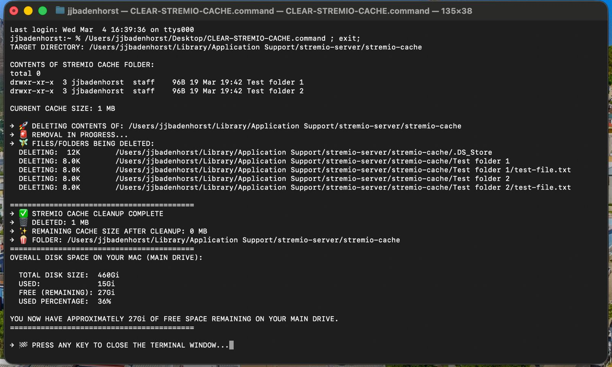
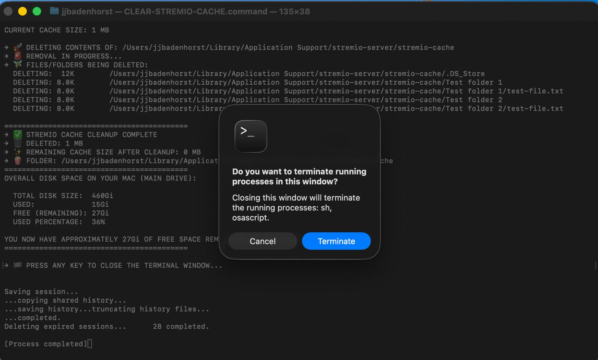

# Stremio Cache Cleaner for macOS

> A simple, safe, and visual Bash script that completely clears the Stremio cache on macOS, freeing up disk space with a nice progress display and final summary.

> Perfect for users who notice Stremio taking up several gigabytes of cache over time.

---

## Features

- **Safe**: Includes safety checks to prevent accidental deletion of important folders
- **Visual**: Shows what’s being deleted, with sizes
- **Informative**: Displays cache size before & after, plus total disk space info
- **User-friendly**: Clear colored emojis and easy-to-read output
- **Auto-close**: Automatically closes the Terminal window when finished (macOS Terminal & iTerm2)
- **One-click ready**: Designed to be saved as a `.command` file (double-click to run)

---

## How to Use

### Option 1: Easy Double-Click (Recommended)

1. Download the script as `CLEAR-STREMIO-CACHE.command`
2. (Optional but recommended) Move it to your Desktop or Applications folder
3. Open a terminal and navigate to the location of the script, and make it executable 

```bash
chmod +x clear-stremio-cache.sh
```

4. Double-click the file → Terminal will open and clean the cache automatically
5. Press any key when finished to close the window

### Option 2: Run from Terminal

```bash
chmod +x CLEAR-STREMIO-CACHE.command
./CLEAR-STREMIO-CACHE.command
```

### Expected output samples:




